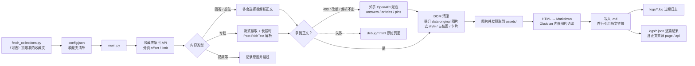

<div align="center">

# 📚 Export-Zhihu-Collections

**把知乎收藏夹导出成本地 Markdown —— 图片自动落盘、正文自动兜底、失败不留坏文件**

[](https://github.com/Guyungy/Export-Zhihu-Collections/actions/workflows/ci.yml)
[](https://www.python.org/)
[]()
[](test/)
[](https://github.com/Guyungy/Export-Zhihu-Collections/commits/main)

[]()
[](LICENSE)
[](CONTRIBUTING.md)
[](#-致谢)

[🚀 快速开始](#-快速开始) · [⚙️ 配置](#-配置说明) · [🖥️ 命令行](#-命令行参数) · [❓ 常见问题](#-常见问题) · [📄 更新日志](CHANGELOG.md) · [🐛 提交问题](https://github.com/Guyungy/Export-Zhihu-Collections/issues/new)

</div>

> **纯本地工具，不带 MCP Server。** 所有请求直连 `zhihu.com`，不经过任何第三方服务，
> 不上传 cookies、不收集数据；导出的内容只落在你自己的磁盘上。
> 需要 AI Agent 集成的话，生态里有衍生分支可用（见 [致谢](#-致谢)）。

---

## 📖 目录

- [✨ 特性一览](#-特性一览)
- [🎬 实际长什么样](#-实际长什么样)
- [🚀 快速开始](#-快速开始)
- [🍪 准备 cookies](#-准备-cookies)
- [⚙️ 配置说明](#-配置说明)
- [🖥️ 命令行参数](#-命令行参数)
- [📁 输出结构](#-输出结构)
- [🧭 工作原理](#-工作原理)
- [🧩 项目结构](#-项目结构)
- [🧪 测试与 CI](#-测试与-ci)
- [🗺️ 路线图](#️-路线图)
- [❓ 常见问题](#-常见问题)
- [🔒 隐私与安全](#-隐私与安全)
- [🤝 反馈与贡献](#-反馈与贡献)
- [🙏 致谢](#-致谢)
- [⚠️ 免责声明](#️-免责声明)
- [🇬🇧 English](#-english)

---

## ✨ 特性一览

| 能力 | 说明 |
| --- | --- |
| 🛡️ **三条正文路线** | 页面解析 → 流式读取 → 知乎 OpenAPI 兜底；被 403 / 改版挡住也能把正文拿回来 |
| 🧯 **失败不留坏状态** | 抓取失败**不写占位 `.md`**，只记日志 + 存 `debug/*.html`，重跑就会重试 |
| 🪄 **懒加载图片还原** | 把 `data-original` 里的真实地址提升为 `src`，API 正文的配图不会整批消失 |
| 📦 **批量导出** | 一次配置多个收藏夹，逐夹归档到独立目录 |
| 🔐 **公开 + 私密** | 无 cookies 也能导公开收藏夹；带 cookies 可导私密收藏夹 |
| 🖼️ **图片本地化** | 正文图片并发下载到 `assets/`，正文改写为 Obsidian 内嵌语法 `![[图片名]]` |
| 🔁 **断点续传** | 已导出且链接一致的文件自动跳过，重复运行不重复下载 |
| 🧠 **内容类型感知** | 回答 / 专栏 / 想法都能导出；视频等暂不支持的类型会明确记录原因 |
| 🧩 **多种选择器** | 每类页面准备多套 DOM 选择器 + 智能正文检测，知乎改版也不容易全挂 |
| 🚀 **并发 + 限速** | 多线程下载正文与图片，全局请求间隔可调，降低被风控的概率 |
| 🔄 **分层重试** | HTTP 层重试 429 / 5xx / 连接重置；正文层再包一层应用层重试（覆盖流式断流） |
| 🧵 **流式读取** | 专栏长文按块读取 + 独立放宽的读超时，正文再长也不容易中途断流 |
| 🪵 **可追溯** | 每次运行产出 `logs/*.log`（过程）与 `logs/*.json`（逐篇结果，含正文来源 `page`/`api`） |
| 💻 **跨平台** | macOS / Windows / Linux / Cygwin 路径正确解析，输出目录可按系统分别配置 |
| 🧪 **离线测试** | 136 项 pytest，不联网、不需要 cookies、0.2 秒跑完，CI 三版本矩阵验证 |

---

## 🎬 实际长什么样

**正常导出**（下例为**输出格式示意**，数字是编的，格式与真实一致）：

```console
$ python main.py
共找到 33 个收藏夹待处理
----------------------------------------------------
 1. 技术-效率工具                343826248 (126 条)
 2. 赚钱-金融市场                630144608 (98 条)
----------------------------------------------------

开始处理收藏夹: 技术-效率工具
收藏夹 '技术-效率工具' 共获取 126 篇可导出回答或专栏
使用 6 个线程下载正文（已跳过 8 篇）
收藏夹 '技术-效率工具' 下载完毕
...
====================================================
导出完成
----------------------------------------------------
收藏夹  : 33 个
文章    : 共 3184 篇 | 新下载 2761 | 跳过 406 | 失败 17
抓取    : API 兜底 42 篇 | 页面重试 118 次
输出目录: /Users/you/Documents/ZhihuExports
日志    : /Users/you/Documents/ZhihuExports/logs/debug_20260920_163001.log
====================================================
```

（`抓取` 这一行只在真的用上兜底或重试时才出现；`失败 17` 对应的是 `logs/*.json` 里 17 条失败记录，
重跑一次就会重新尝试，不会留下坏文件。）

**cookies 过期时** —— 下面是**真实输出**（cookies 已过期状态下实测），错误提示直接告诉你怎么修：

```console
$ python main.py --list
警告：检测到已过期的 cookies: z_c0, d_c0, ...，请重新导出知乎 cookies
!!!!!!!!!!!!!!!!!!!!!!!!!!!!!!!!!!!!!!!!!!!!!!!!!!!!!!!!!!!!
cookies 已失效，知乎接口拒绝访问（ERR_LOGIN_TICKET_EXPIRED）
解决办法：重新导出登录态 cookies.json（参考 README「准备 cookies」）
!!!!!!!!!!!!!!!!!!!!!!!!!!!!!!!!!!!!!!!!!!!!!!!!!!!!!!!!!!!!
 1. 技术-效率工具                  343826248 (0 条)
```

导出后的 Markdown 见 [输出结构](#-输出结构)。

---

## 🚀 快速开始

```bash
# 1. 安装依赖
pip install -r requirements.txt

# 2. 准备配置（复制示例再改）
cp config_examples.json config.json

# 3. 先验证配置：每个收藏夹只试抓 1 条
python main.py --dry-run

# 4. 确认没问题，正式导出
python main.py
```

最小可用配置（`config.json`）：

```json
{
  "zhihuUrls": [
    { "name": "技术-效率工具", "url": "https://www.zhihu.com/collection/343826248" }
  ],
  "outputPath": "",
  "openCollection": false
}
```

> 输出的收藏夹链接就是浏览器地址栏里的 `https://www.zhihu.com/collection/<数字 ID>`；
> 也可以直接只填 `343826248` 这样的 ID。

### 自动抓取「我的收藏夹」清单

```bash
python fetch_collections.py   # 抓取并写回 config.json（需要 cookies）
python main.py                # 紧接着直接导出
```

---

## 🍪 准备 cookies

> 只在两种情况下需要：导出**私密收藏夹**，或运行 `fetch_collections.py` 抓取自己的收藏夹清单。
> 公开收藏夹不需要 cookies。

1. 浏览器登录 <https://www.zhihu.com>
2. `F12` → **Application / Storage** → **Cookies** → `https://www.zhihu.com`
3. 至少复制这三项的值：`z_c0`、`d_c0`、`SESSIONID`
4. 按 `cookies.example.json` 的格式存成项目根目录的 `cookies.json`

```json
[
  { "name": "z_c0", "value": "粘贴 z_c0 的值" },
  { "name": "d_c0", "value": "粘贴 d_c0 的值" },
  { "name": "SESSIONID", "value": "粘贴 SESSIONID 的值" }
]
```

也兼容浏览器插件导出的完整列表（带 `domain` / `expirationDate`）和 `{"名字": "值"}` 对象两种格式。

> [!WARNING]
> `cookies.json` 等同于账号登录凭证。它**已被 `.gitignore` 忽略**，切勿提交到任何仓库、也不要贴进 issue。
> 程序启动时会检查过期时间，过期会直接提示你重新导出。

看到 `401` / `ERR_LOGIN_TICKET_EXPIRED` / `need_login` / `code 10003` 都说明 cookies 失效了 ——
重新导出即可，也可以先跑一次体检：

```bash
python tools/analyze_issue.py     # cookies → 登录接口 → 页面结构 → 试跑抓取 → 兜底通道
```

---

## ⚙️ 配置说明

```json
{
  "zhihuUrls": [
    { "name": "收藏夹显示名", "url": "https://www.zhihu.com/collection/123456789" }
  ],
  "outputPath": "",
  "os": "",
  "openCollection": false,
  "downloadWorkers": 6,
  "imageWorkers": 4,
  "requestDelay": 0.4,
  "pageTimeout": 30,
  "longPageTimeout": 120,
  "fetchRetries": 3,
  "apiFallback": true
}
```

| 字段 | 类型 | 默认值 | 说明 |
| --- | --- | --- | --- |
| `zhihuUrls` | array | `[]` | 要导出的收藏夹列表，`name` 只用于目录命名，`url` 也可只填数字 ID |
| `outputPath` | string \| object | `""` | 输出根目录。留空 → 项目下的 `downloads/` |
| `os` | string | `""` | 目标系统，留空自动检测；主要用于解析跨平台路径 |
| `openCollection` | bool | `false` | 置 `true` 时 `main.py` 会提醒你先运行 `fetch_collections.py` |
| `downloadWorkers` | int | `6` | 正文下载并发数（1–16） |
| `imageWorkers` | int | `4` | 单篇正文内图片并发数（1–16） |
| `requestDelay` | float | `0.4` | 全局请求最小间隔（秒），越大越安全越慢（0–10） |
| `pageTimeout` | float | `30` | 普通页面请求超时（秒，≤600） |
| `longPageTimeout` | float | `120` | 专栏文章的读超时（秒），长文建议保持较大 |
| `fetchRetries` | int | `3` | 正文抓取的应用层重试次数（0–10） |
| `apiFallback` | bool | `true` | 页面抓取失败时是否改走知乎 OpenAPI 取正文 |

所有数值都会被夹到合法区间，写超范围的值不会崩，只会被纠正。

### `outputPath` 的两种写法

**① 单个路径**（当前系统使用）：

```json
"outputPath": "~/Documents/ZhihuExports"
```

**② 按系统分别配置**（同一份配置在多台机器上都能用）：

```json
"outputPath": {
  "windows": "D:/Documents/Zhihu知乎",
  "macos": "~/Documents/ZhihuExports",
  "linux": "/home/user/zhihu-exports"
}
```

> 把 Windows 路径填在 macOS 上不会生成一个名叫 `D:` 的怪目录 —— 程序会识别出不匹配并回退到
> `downloads/`，同时给出提示。Cygwin 的 `/cygdrive/d/...` 也认。完整样例见 `config_examples.json`。

---

## 🖥️ 命令行参数

### `main.py` —— 导出

```bash
python main.py [选项]
```

| 参数 | 说明 |
| --- | --- |
| `--config PATH` | 指定配置文件，默认 `./config.json` |
| `--output PATH` | 覆盖配置里的 `outputPath`（优先级最高） |
| `--only NAME_OR_ID` | 只导出指定收藏夹，按名称或 ID 模糊匹配，可重复传入 |
| `--workers N` | 覆盖正文并发数（1–16） |
| `--delay SEC` | 覆盖全局请求间隔 |
| `--skip-images` | 只导出文字，图片保留远程链接 |
| `--no-api-fallback` | 禁用 API 兜底（默认会在页面失败时改走 OpenAPI） |
| `--retries N` | 覆盖正文抓取的重试次数（0–10） |
| `--list` | 只列出收藏夹与条目数量，不下载 |
| `--dry-run` | 每个收藏夹只试抓 1 条，用来验证配置 |
| `-v, --verbose` | 控制台输出调试级日志 |

```bash
# 只导出两个收藏夹、限制并发、放慢请求
python main.py --only 技术-效率工具 --only 630144608 --workers 4 --delay 1.0

# 先看看有哪些收藏夹、各有多少条
python main.py --list

# 换台机器/换盘，临时指定输出目录
python main.py --output ~/Desktop/zhihu-backup
```

### `fetch_collections.py` —— 抓取我的收藏夹清单

| 参数 | 说明 |
| --- | --- |
| `--config PATH` | 指定要写回的配置文件 |
| `--urls` | 改为写入旧版 `zhihuUrls.json` |
| `--max-pages N` | HTML 翻页上限，默认 50 |
| `--dry-run` | 只打印结果，不写任何文件 |

### `tools/` —— 诊断脚本

| 脚本 | 用途 |
| --- | --- |
| `tools/analyze_issue.py` | 体检 cookies → 登录接口 → 页面结构 → 试跑抓取 → 正文 API 兜底通道 |
| `tools/debug_page.py` | 抓下「我的收藏夹」原始 HTML，分析真实 class 名与链接 |

---

## 📁 输出结构

```text
downloads/                     # 或 outputPath 指定的目录
├── 技术-效率工具/              # 每个收藏夹一个目录
│   ├── 某篇文章标题.md
│   ├── 另一篇文章标题.md
│   └── assets/                # 本地化后的图片
│       ├── v2-abc123_1440w.jpg
│       └── v2-def456_720w.jpg
├── 赚钱-金融市场/
├── logs/
│   ├── debug_20260920_163001.log     # 运行过程日志（DEBUG 级）
│   └── 20260920_163420.json          # 逐篇结果：正常下载 / 跳过 / 失败 + 正文来源
└── debug/
    ├── debug_answer_2271842801.html  # 解析失败的回答页原始 HTML
    └── debug_post_386395767.html     # 解析失败的专栏页原始 HTML
```

导出的 Markdown 长这样：

```markdown
> https://www.zhihu.com/question/506166712/answer/2271842801

## 小标题

正文内容……

![[v2-abc123_1440w.jpg]]
(图片说明)

参考资料 [^1]
```

- 首行固定是原文链接的引用块 —— 这也是「跳过已下载」的判定依据
- 图片使用 Obsidian 内嵌语法 `![[文件名]]`，下一行括号内是原始 `alt` 文本
- 文件名自动替换非法字符、全角化 `?` / `:`，并按 UTF-8 字节长度截断，避免「文件名过长」导致整篇失败

---

## 🧭 工作原理



一次 `python main.py` 的完整流程：

1. 读配置 → 解析输出路径（跨平台、支持按系统分别配置）
2. 初始化日志（落在输出根目录的 `logs/`，与导出内容同源）
3. 建立带重试的会话，加载 cookies，设置请求间隔
4. 逐个收藏夹：分页取条目 → 按类型解析标题和链接
5. 过滤出未下载的文章 → 线程池并发下载正文
6. 每篇正文：页面路线（含重试）→ 失败则 API 兜底 → 解析 DOM → 清理 → 并发预取图片 → 转 Markdown → 写文件
7. 汇总：收藏夹数、文章数、新下载 / 跳过 / 失败，以及 API 兜底篇数与重试次数

### 三条正文获取路线

| 路线 | 触发条件 | 说明 |
| --- | --- | --- |
| **页面解析** | 默认 | 直接请求网页，多套选择器 + 智能检测定位正文 |
| **流式读取** | 专栏文章 | 长正文按块读取，读超时单独放宽到 `longPageTimeout` |
| **OpenAPI 兜底** | 页面 403 / 404 / 结构改版 | 调 `/api/v4/{answers,articles,pins}/{id}` 取正文 HTML |

API 兜底返回的是**正文片段**而不是整页，所以不受页面改版影响，也不需要再猜选择器。
每篇的正文来源会记在 `logs/*.json` 的 `source` 字段里（`page` / `api`），便于事后核对。

### 几个刻意的设计取舍

| 决定 | 原因 |
| --- | --- |
| 抓取失败**不写**占位文件 | 写了就会被「已下载」判定拦住，那篇文章永远不再重试 |
| 单张图失败降级为远程链接 | 一张挂了的图不该让整篇正文丢失 |
| `Accept-Encoding` 按本机解码能力协商 | 声明了却解不开的 `br` / `zstd` 会让正文变成乱码，比 403 更难排查 |
| 4xx / 410 不重试 | 重试注定失败的请求只会白等，还增加被风控的概率 |
| 图片名带内容摘要后缀 | 不同图重名时不互相覆盖，同一张图跨文章又能命中缓存 |
| `import main` 无副作用 | 能被别的脚本安全地 `import` 复用，而不触发建目录、读 cookies 这类动作 |

---

## 🧩 项目结构

```text
Export-Zhihu-Collections/
├── main.py                    # 入口：导出收藏夹（CLI）
├── fetch_collections.py       # 入口：抓取「我的收藏夹」并写回配置
├── get_collections.py         # 兼容层（旧脚本 import 用，建议改用 fetch_collections）
├── utils.py                   # 文件名清理与按字节截断
├── zhihu_export/              # 内部实现包
│   ├── config.py              #   配置加载、校验、跨平台路径解析
│   ├── http.py                #   会话、浏览器请求头、cookies、重试、限流
│   ├── collections.py         #   收藏夹清单与条目抓取、类型解析
│   ├── api.py                 #   正文 API 兜底（answers / articles / pins）
│   ├── converter.py           #   HTML → Markdown、图片下载器、懒加载图片还原
│   └── logging_utils.py       #   日志初始化与强制刷新
├── tools/                     # 诊断脚本
├── test/                      # pytest 测试（离线可跑）
│   ├── fixtures/              #   知乎页面样例 HTML
│   └── legacy/                #   历史自检脚本（pytest 不收集）
├── .github/workflows/ci.yml   # CI：3 个 Python 版本跑同一套测试
├── config.json                # 你的配置
├── config_examples.json       # 各种场景的配置样例
├── cookies.example.json       # cookies 模板
├── CHANGELOG.md               # 更新日志
├── CONTRIBUTING.md            # 贡献指南
└── pyproject.toml             # 依赖 / pytest 配置
```

---

## 🧪 测试与 CI

```bash
pip install -r requirements-dev.txt
pytest                      # 136 项，全部离线：不联网、不需要 cookies、0.2 秒
```

| 测试文件 | 项数 | 覆盖范围 |
| --- | --- | --- |
| `test/test_api.py` | 56 | API 兜底的 URL 解析、pin 分块拼装、错误翻译、403 回退、流式读取、懒加载图还原 |
| `test/test_collections.py` | 24 | 收藏夹 ID 解析、条目类型解析、分页、401 提示、页面改版兜底 |
| `test/test_config.py` | 18 | 配置加载、跨平台路径解析、并发数边界、旧版 `zhihuUrls.json` 兼容 |
| `test/test_converter.py` | 17 | 图片下载 / 缓存 / 命名冲突 / 失败降级、链接卡片、mailto、脚注回链 |
| `test/test_main_integration.py` | 15 | 端到端：整夹导出、重复运行跳过、失败不写占位文件、`--list` / `--skip-images` |
| `test/test_utils.py` | 6 | 文件名清理、非法字符、按字节截断 |

测试用假会话（`test/helpers.py`）+ 4 份页面样例（`test/fixtures/*.html`），所以**知乎改版不会让测试随机变红**。
真实抓到的错误响应（`need_login` / `ERR_LOGIN_TICKET_EXPIRED` / 风控 `code 10003`）也都固化成了回归用例。

CI 在 Python 3.8 / 3.11 / 3.13 上跑同一套测试：`.github/workflows/ci.yml`。

`test/legacy/` 里是历史调试阶段留下的自检脚本（按源码文本做模式匹配的那批），**不参与 pytest 收集**，仅作记录留存。

---

## 🗺️ 路线图

- [x] 正文 API 兜底 + 专栏流式读取 + 分层重试
- [x] 离线测试套件与 CI
- [ ] **可交互的进度输出**：目前 `--list` / 汇总够用，但长任务缺少实时进度条
- [ ] **重试清单**：把 `logs/*.json` 里的失败项直接变成一次「只重跑失败篇」的入口
- [ ] **更多导出格式**：CSV / JSON 元数据（标题、作者、收藏时间、原文链接）
- [ ] **可选的内容摘要**：默认关闭，需自备 API Key，不在默认路径上引入任何外部调用

> 有意不做：GUI、MCP Server、内置云端服务。这个项目只负责把导出做稳、做透明。

欢迎在 [issues](https://github.com/Guyungy/Export-Zhihu-Collections/issues) 里认领或提需求。

---

## ❓ 常见问题

<details>
<summary><b>导出的图片语法 <code>![[xxx.jpg]]</code> 在别的编辑器里不显示？</b></summary>

这是 Obsidian 的内嵌语法。想要标准 Markdown 图片语法，批量替换即可：

```bash
python - <<'PY'
import pathlib, re
for md in pathlib.Path("downloads").rglob("*.md"):
    text = md.read_text(encoding="utf-8")
    text = re.sub(r"!\[\[(.+?)\]\]", r"", text)
    md.write_text(text, encoding="utf-8")
PY
```

或者加 `--skip-images` 重新导出，图片会直接保留知乎的远程链接。
</details>

<details>
<summary><b>页面老是返回 403，API 兜底什么时候生效？</b></summary>

页面请求返回 403（或 404、结构改版解析不出正文）时，程序会自动改用知乎 OpenAPI 拿同一篇正文：

| 内容类型 | 接口 |
| --- | --- |
| 回答 | `https://www.zhihu.com/api/v4/answers/{id}?include=content` |
| 专栏 | `https://www.zhihu.com/api/v4/articles/{id}?include=content` |
| 想法 | `https://www.zhihu.com/api/v4/pins/{id}` |

拿回来的是**正文片段**，因此不受页面改版影响。想临时关掉用 `--no-api-fallback`，
或把配置里的 `apiFallback` 设为 `false`。

> [!NOTE]
> 兜底接口同样需要有效登录态。日志里出现「登录票据已失效」「需要登录（need_login）」
> 或「被风控拦截（code 10003）」，都说明 cookies 过期了 —— 重新导出即可。
> 这些提示是把知乎的机器码翻译过来的，不是网络问题。
> 另外：换请求头**绕不过** 403，别在这上面浪费时间。

想看每条到底走的是哪条路线，翻 `logs/*.json` 里的 `source` 字段（`page` 或 `api`）。
</details>

<details>
<summary><b>导出的 Markdown 里图片变成了远程链接 <code></code>？</b></summary>

说明那张图的下载失败了（网络抖动、图床 403、`assets/` 不可写等）。失败不会影响整篇导出，
正文照常落地，只是该图降级成远程链接，同时计入日志里的 `image_failures`。

重跑一次通常就能补上；也可以删掉对应 `.md` 强制重下（图片本身有跨文章缓存，命中就直接复用）。
</details>

<details>
<summary><b>提示 401 / <code>ERR_LOGIN_TICKET_EXPIRED</code>，或者一个收藏夹都抓不到？</b></summary>

cookies 过期了。重新按 [准备 cookies](#-准备-cookies) 导出，然后先跑一次体检：

```bash
python tools/analyze_issue.py
```

它会依次检查 cookies 完整性、登录接口、页面结构、试跑一次抓取，并探测正文 API 兜底通道。
</details>

<details>
<summary><b>某篇文章导出失败，还会留下一个「已经下载」的坏文件吗？</b></summary>

不会。抓取失败的文章**不会生成占位 `.md`**，只会在 `logs/*.json` 里记录失败原因，原始页面存到 `debug/`。
这样可以避免「失败一次就被当成已下载、永远不再重试」的问题 —— 直接重跑 `python main.py` 就会重新尝试。

若某篇始终失败，看 `debug/` 里保存的 HTML 就能判断是被删、被 404 还是需要登录。
</details>

<details>
<summary><b>怎么重新导出某个已下载的文章？</b></summary>

删掉对应的 `.md`（或改掉它首行的原文链接）后重跑即可。判定规则是「文件存在 + 非空 + 首行引用块里的 URL 一致」。
</details>

<details>
<summary><b>会被知乎封号吗？怎么更稳？</b></summary>

工具内置了分层重试与全局限速，但仍建议：

- `requestDelay` 设为 `0.5` ~ `1.5`（默认 0.4）
- `downloadWorkers` 不超过 `8`
- 大批量导出分几次跑，别一次上万篇

如果真的被拦，看到的会是 403 或风控 `code 10003`，此时停一会儿再跑，不要连着重试。
</details>

<details>
<summary><b>收藏夹文件夹名字和配置里的 <code>name</code> 不一样？</b></summary>

目录名会先做文件名安全化（替换 `/ \ " &lt; &gt; | *`、全角化 `?` `:`、按字节截断过长标题），避免在 Windows 上创建失败。
</details>

<details>
<summary><b>支持哪些内容类型？</b></summary>

回答、专栏、想法会导出为 Markdown；视频等纯多媒体内容暂不支持，程序会打印跳过原因并写入日志。
</details>

<details>
<summary><b>这个工具和生态里的衍生分支有什么区别？</b></summary>

本仓库是原始项目，专注「把导出做稳」；衍生分支在此之上加了 MCP Server，面向 AI Agent 集成。
差异见 [致谢](#-致谢) 一节。**本项目有意不包含 MCP。**
</details>

---

## 🔒 隐私与安全

| 项 | 情况 |
| --- | --- |
| 数据流向 | 只与 `zhihu.com` 通信，不经任何第三方服务、不上报任何统计 |
| cookies | 只用于向知乎发起请求；`.gitignore` 已排除，程序也不会打印其值 |
| 导出内容 | 只落在你指定的本地目录 |
| 网络依赖 | 测试全部离线；CI 也不联网抓知乎 |
| 唯一的凭据风险 | 你自己把 `cookies.json` 提交进仓库或贴进 issue —— 别这么做 |

---

## 🤝 反馈与贡献

- **报 bug**：[开 issue](https://github.com/Guyungy/Export-Zhihu-Collections/issues/new)，附上完整报错、
  出问题的 URL（或说明是回答 / 专栏 / 想法）、系统与 Python 版本。
  带上 `logs/debug_*.log` 里的报错段落最有帮助。
- **提 PR**：先读 [CONTRIBUTING.md](CONTRIBUTING.md)，跑通 `pytest` 再提交。
- **提问前**：先跑一次 `python tools/analyze_issue.py`，多数「抓不到」都是 cookies 过期。

> [!CAUTION]
> 提问或截图时**不要包含 `cookies.json` 的任何内容**，那是账号登录凭证。

---

## 🙏 致谢

- **正文 API 兜底**与**专栏流式读取**两条思路来自衍生分支
  [JasonJarvan/Zhihu-Collections-MCP](https://github.com/JasonJarvan/Zhihu-Collections-MCP)。
  本仓库在其思路上**重写**并补齐了 `pins`（想法）支持、错误体翻译、懒加载图片还原、
  API 调用纳入统一限流、4xx 不重试，以及配套的离线测试。**未引入其 MCP Server 部分。**
- 早期的多线程改造与 README 改进来自社区 PR（[@sabahmax-dev](https://github.com/sabahmax-dev) 等）。

<details>
<summary><b>与衍生分支的差异（点开看）</b></summary>

| | 本项目 | Zhihu-Collections-MCP |
| --- | --- | --- |
| 定位 | 纯本地 CLI / Python 库 | CLI + MCP Server |
| 正文兜底范围 | 回答 / 专栏 / 想法 | 回答 |
| 压缩编码协商 | 按本机解码能力声明 | 声明 `br` / `zstd`（本机无解码库时正文会乱码） |
| 失败处理 | 不写占位文件，可无损重跑 | 无对应处理 |
| 测试 | 136 项离线 pytest + 三版本 CI | `test/` 下 19 个手动脚本 |
| 许可证 | GPL-3.0 | 未声明 |
| 收藏夹并发 | 线程池 | 串行 + 随机 sleep |

> 需要 MCP 集成的话用那个分支即可；本项目有意保持「只做导出」这一件事。

</details>

---

## ⚠️ 免责声明

- 本项目仅用于**个人学习、备份与内容整理**，请勿用于商业分发或大规模爬取。
- 使用前请阅读并遵守知乎的用户协议与 robots 规则；因使用本项目产生的任何后果由使用者自行承担。
- 请勿将 `cookies.json`、导出内容等个人数据提交到公开仓库。

---

## 📜 License

[GPL-3.0](LICENSE)

---

## 🇬🇧 English

**Export-Zhihu-Collections** exports your Zhihu (知乎) collections to local Markdown, ready for
Obsidian / Logseq / Typora. Images are downloaded into `assets/` and rewritten to
`![[image.jpg]]` embeds; already-exported articles are skipped on the next run.

Highlights: three content-fetch routes (page → streaming → OpenAPI fallback),
failed fetches never leave a bogus file behind, layered retries with a global rate limit,
cross-platform path handling, and 136 offline tests (no network, no cookies required).

```bash
pip install -r requirements.txt
cp config_examples.json config.json   # then edit it
python main.py --dry-run              # verify config
python main.py                        # export
```

Fully local: it talks to `zhihu.com` only, with no third-party service, telemetry, or MCP server.
