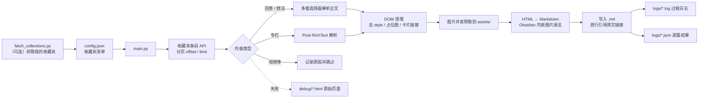

<div align="center">

# 📚 Export-Zhihu-Collections

**把知乎收藏夹一键导出成本地 Markdown —— 图片自动本地化，Obsidian / 思源 / Typora 直接可用**

[](https://www.python.org/)
[]()
[](#-开发与测试)
[]()
[](LICENSE)

</div>

---

## 📖 目录

- [✨ 特性](#-特性)
- [🚀 快速开始](#-快速开始)
- [🍪 准备 cookies](#-准备-cookies)
- [⚙️ 配置说明](#-配置说明)
- [🖥️ 命令行参数](#-命令行参数)
- [📁 输出结构](#-输出结构)
- [🧭 工作原理](#-工作原理)
- [🧩 项目结构](#-项目结构)
- [🧪 开发与测试](#-开发与测试)
- [❓ 常见问题](#-常见问题)
- [⚠️ 免责声明](#-免责声明)

---

## ✨ 特性

| 能力 | 说明 |
| --- | --- |
| 📦 **批量导出** | 一次配置多个收藏夹，逐夹归档到独立目录 |
| 🔐 **公开 + 私密** | 无 cookies 也能导公开收藏夹；带 cookies 可导私密收藏夹 |
| 🖼️ **图片本地化** | 正文图片并发下载到 `assets/`，正文改写为 Obsidian 内嵌语法 `![[图片名]]` |
| 🔁 **断点续传** | 已导出且链接一致的文件自动跳过，重复运行不重复下载 |
| 🧠 **内容类型感知** | 回答 / 专栏 / 想法都能导出；视频等暂不支持的类型会明确记录并跳过 |
| 🧩 **多种选择器** | 每类页面准备多套 DOM 选择器 + 智能正文检测，知乎改版也不容易全挂 |
| 🛡️ **失败隔离** | 单篇文章、单张图片失败都不影响其它内容；失败页面 HTML 自动存到 `debug/` |
| 🚀 **并发 + 限速** | 多线程下载正文与图片，全局请求间隔可调，降低被风控的概率 |
| 🔄 **自动重试** | 429 / 5xx / 连接重置自动指数退避重试 |
| 🪵 **可追溯** | 每次运行都产出 `logs/*.log`（过程）与 `logs/*.json`（逐篇结果） |
| 💻 **跨平台** | macOS / Windows / Linux / Cygwin 路径都能正确解析，输出目录可按系统分别配置 |

---

## 🚀 快速开始

```bash
# 1. 安装依赖
pip install -r requirements.txt

# 2. 准备配置（可以直接复制示例再改）
cp config_examples.json config.json

# 3. 导出收藏夹
python main.py
```

最小可用配置（`config.json`）：

```json
{
  "zhihuUrls": [
    { "name": "技术-效率工具", "url": "https://www.zhihu.com/collection/343826248" }
  ],
  "outputPath": "",
  "openCollection": false
}
```

> 不知道自己的收藏夹链接？看下一节的 `fetch_collections.py` 自动抓取。

### 自动抓取「我的收藏夹」清单

```bash
python fetch_collections.py          # 抓取并写回 config.json（并把 openCollection 复位为 false）
python main.py                       # 紧接着直接导出
```

---

## 🍪 准备 cookies

> 导出**私密收藏夹**、或使用 `fetch_collections.py` 抓取自己的收藏夹清单时，都需要登录态 cookies。

1. 浏览器登录 <https://www.zhihu.com>
2. `F12` → **Application / Storage** → **Cookies** → `https://www.zhihu.com`
3. 至少复制这三项的值：`z_c0`、`d_c0`、`SESSIONID`
4. 按 `cookies.example.json` 的格式存成项目根目录的 `cookies.json`

```json
[
  { "name": "z_c0", "value": "粘贴 z_c0 的值" },
  { "name": "d_c0", "value": "粘贴 d_c0 的值" },
  { "name": "SESSIONID", "value": "粘贴 SESSIONID 的值" }
]
```

也兼容浏览器插件导出的完整列表（带 `domain` / `expirationDate`）和 `{"名字": "值"}` 对象两种格式。

> [!WARNING]
> `cookies.json` 等同于账号登录凭证，**已被 `.gitignore` 忽略**，切勿提交到任何仓库。
> 程序启动时会检查过期时间，过期会直接提示你重新导出。

如果看到 `ERR_LOGIN_TICKET_EXPIRED` 或 `401`，说明 cookies 失效了 —— 重新导出即可，可先用 `python tools/analyze_issue.py` 一键体检。

---

## ⚙️ 配置说明

```json
{
  "zhihuUrls": [
    { "name": "收藏夹显示名", "url": "https://www.zhihu.com/collection/123456789" }
  ],
  "outputPath": "",
  "os": "",
  "openCollection": false,
  "downloadWorkers": 6,
  "imageWorkers": 4,
  "requestDelay": 0.4
}
```

| 字段 | 类型 | 默认值 | 说明 |
| --- | --- | --- | --- |
| `zhihuUrls` | array | `[]` | 要导出的收藏夹列表，`name` 只用于目录命名 |
| `outputPath` | string \| object | `""` | 输出根目录。留空 → 项目下的 `downloads/` |
| `os` | string | `""` | 目标系统，留空自动检测；主要用于解析跨平台路径 |
| `openCollection` | bool | `false` | 置 `true` 时 `main.py` 会提醒你先运行 `fetch_collections.py` |
| `downloadWorkers` | int | `6` | 正文下载并发数（1–16） |
| `imageWorkers` | int | `4` | 单篇正文内图片并发数（1–16） |
| `requestDelay` | float | `0.4` | 全局请求最小间隔（秒），越大越安全越慢 |

### `outputPath` 的两种写法

**① 单个路径**（当前系统使用）：

```json
"outputPath": "~/Documents/ZhihuExports"
```

**② 按系统分别配置**（同一份配置在多台机器上都能用）：

```json
"outputPath": {
  "windows": "D:/Documents/Zhihu知乎",
  "macos": "~/Documents/ZhihuExports",
  "linux": "/home/user/zhihu-exports"
}
```

> 把 Windows 路径填在 macOS 上不会生成一个名叫 `D:` 的怪目录 —— 程序会识别出不匹配并回退到 `downloads/`，同时给出提示。

---

## 🖥️ 命令行参数

### `main.py` —— 导出

```bash
python main.py [选项]
```

| 参数 | 说明 |
| --- | --- |
| `--config PATH` | 指定配置文件，默认 `./config.json` |
| `--output PATH` | 覆盖配置里的 `outputPath`（优先级最高） |
| `--only NAME_OR_ID` | 只导出指定收藏夹，按名称或 ID 模糊匹配，可重复传入 |
| `--workers N` | 覆盖正文并发数（1–16） |
| `--delay SEC` | 覆盖全局请求间隔 |
| `--skip-images` | 只导出文字，图片保留远程链接 |
| `--list` | 只列出收藏夹与条目数量，不下载 |
| `--dry-run` | 每个收藏夹只试抓 1 条，用来验证配置 |
| `-v, --verbose` | 控制台输出调试级日志 |

```bash
# 示例：只导出两个收藏夹、限制并发、放慢请求
python main.py --only 技术-效率工具 --only 630144608 --workers 4 --delay 1.0

# 示例：先看看有哪些收藏夹、各有多少条
python main.py --list
```

### `fetch_collections.py` —— 抓取我的收藏夹清单

| 参数 | 说明 |
| --- | --- |
| `--config PATH` | 指定要写回的配置文件 |
| `--urls` | 改为写入旧版 `zhihuUrls.json` |
| `--max-pages N` | HTML 翻页上限，默认 50 |
| `--dry-run` | 只打印结果，不写任何文件 |

### `tools/` —— 诊断脚本

| 脚本 | 用途 |
| --- | --- |
| `tools/analyze_issue.py` | 体检 cookies → 登录接口 → 页面结构 → 试跑抓取 |
| `tools/debug_page.py` | 抓下「我的收藏夹」原始 HTML，分析真实 class 名与链接 |

---

## 📁 输出结构

```text
downloads/                     # 或 outputPath 指定的目录
├── 技术-效率工具/              # 每个收藏夹一个目录
│   ├── 某篇文章标题.md
│   ├── 另一篇文章标题.md
│   └── assets/                # 本地化后的图片
│       ├── v2-abc123_1440w.jpg
│       └── v2-def456_720w.jpg
├── 赚钱-金融市场/
├── logs/
│   ├── debug_20260920_163001.log     # 运行过程日志（DEBUG 级）
│   └── 20260920_163420.json          # 逐篇结果：正常下载 / 跳过 / 失败
└── debug/
    ├── debug_answer_2271842801.html  # 解析失败的回答页原始 HTML
    └── debug_post_386395767.html     # 解析失败的专栏页原始 HTML
```

导出的 Markdown 长这样：

```markdown
> https://www.zhihu.com/question/506166712/answer/2271842801

## 小标题

正文内容……

![[v2-abc123_1440w.jpg]]
(图片说明)

参考资料 [^1]
```

- 首行固定是原文链接的引用块 —— 这也是「跳过已下载」的判定依据
- 图片使用 Obsidian 内嵌语法 `![[文件名]]`，下一行括号内是原始 `alt` 文本
- 文件名会自动替换非法字符、全角化 `?` / `:`，并按字节长度截断，避免「文件名过长」导致整篇失败

---

## 🧭 工作原理



一次 `python main.py` 的完整流程：

1. 读配置 → 解析输出路径（跨平台、支持按系统分别配置）
2. 初始化日志（落在输出根目录的 `logs/`，与导出内容同源）
3. 建立带重试的会话，加载 cookies，设置请求间隔
4. 逐个收藏夹：分页取条目 → 按类型解析标题和链接
5. 过滤出未下载的文章 → 线程池并发下载正文
6. 每篇正文：解析 DOM → 清理 → 并发预取图片 → 转 Markdown → 写文件
7. 汇总：收藏夹数、文章数、新下载 / 跳过 / 失败，写明输出目录与日志路径

---

## 🧩 项目结构

```text
Export-Zhihu-Collections/
├── main.py                    # 入口：导出收藏夹（CLI）
├── fetch_collections.py       # 入口：抓取「我的收藏夹」并写回配置
├── get_collections.py         # 兼容层（旧脚本 import 用，建议改用 fetch_collections）
├── utils.py                   # 文件名清理与按字节截断
├── zhihu_export/              # 内部实现包
│   ├── config.py              #   配置加载、校验、跨平台路径解析
│   ├── http.py                #   会话、请求头、cookies、重试、限流
│   ├── collections.py         #   收藏夹清单与条目抓取、类型解析
│   ├── converter.py           #   HTML → Markdown、图片下载器
│   └── logging_utils.py       #   日志初始化与强制刷新
├── tools/                     # 诊断脚本
├── test/                      # pytest 测试（离线可跑）
│   ├── fixtures/              #   知乎页面样例 HTML
│   └── legacy/                #   历史自检脚本（pytest 不收集）
├── config.json                # 你的配置
├── config_examples.json       # 各种场景的配置样例
├── cookies.example.json       # cookies 模板
└── pyproject.toml             # 依赖 / pytest 配置
```

---

## 🧪 开发与测试

```bash
pip install -r requirements-dev.txt
pytest                      # 80 项测试，全部离线，无需 cookies、不联网
```

| 测试文件 | 覆盖范围 |
| --- | --- |
| `test/test_config.py` | 配置加载、跨平台路径解析、并发数边界、旧版 `zhihuUrls.json` 兼容 |
| `test/test_utils.py` | 文件名清理、非法字符、按字节截断 |
| `test/test_collections.py` | 收藏夹 ID 解析、条目类型解析、分页、401 提示、页面改版兜底 |
| `test/test_converter.py` | 图片下载 / 缓存 / 命名冲突 / 失败降级、链接卡片、mailto、脚注回链 |
| `test/test_main_integration.py` | 端到端：整夹导出、重复运行跳过、失败不写占位文件、`--list` / `--skip-images` |

`test/legacy/` 里是历史调试阶段留下的自检脚本（按源码文本做模式匹配的那批），**不参与 pytest 收集**，仅作记录留存。

---

## ❓ 常见问题

<details>
<summary><b>导出的图片语法 <code>![[xxx.jpg]]</code> 在别的编辑器里不显示？</b></summary>

这是 Obsidian 的内嵌语法。想要标准 Markdown 图片语法，批量替换即可：

```bash
# 把 ![[a.jpg]] 换成 
python - <<'PY'
import pathlib, re
for md in pathlib.Path("downloads").rglob("*.md"):
    text = md.read_text(encoding="utf-8")
    text = re.sub(r"!\[\[(.+?)\]\]", r"", text)
    md.write_text(text, encoding="utf-8")
PY
```

或者加 `--skip-images` 重新导出，图片会直接保留知乎的远程链接。
</details>

<details>
<summary><b>提示 401 / <code>ERR_LOGIN_TICKET_EXPIRED</code>，或者一个收藏夹都抓不到？</b></summary>

cookies 过期了。重新按 [准备 cookies](#-准备-cookies) 导出，然后先跑一次体检：

```bash
python tools/analyze_issue.py
```

它会依次检查 cookies 完整性、登录接口、页面结构，并试跑一次抓取。
</details>

<details>
<summary><b>某篇文章导出失败，还会留下一个「已经下载」的坏文件吗？</b></summary>

不会。抓取失败的文章**不会生成占位 `.md`**，只会在 `logs/*.json` 里记录失败原因，原始页面存到 `debug/`。
这样可以避免「失败一次就被当成已下载、永远不再重试」的问题 —— 直接重跑 `python main.py` 就会重新尝试。

若某篇始终失败，看 `debug/` 里保存的 HTML 就能判断是被删、被 404 还是需要登录。
</details>

<details>
<summary><b>怎么重新导出某个已下载的文章？</b></summary>

删掉对应的 `.md`（或改掉它首行的原文链接）后重跑即可。判定规则是「文件存在 + 非空 + 首行引用块里的 URL 一致」。
</details>

<details>
<summary><b>会被知乎封号吗？怎么更稳？</b></summary>

工具内置了重试与限速，但仍建议：

- `requestDelay` 设为 `0.5` ~ `1.5`（默认 0.4）
- `downloadWorkers` 不超过 `8`
- 大批量导出时分几次跑，别一次上万篇
</details>

<details>
<summary><b>收藏夹文件夹名字和配置里的 <code>name</code> 不一样？</b></summary>

目录名会先做文件名安全化（替换 `/ \ " &lt; &gt; | *`、全角化 `?` `:`、截断过长标题），避免在 Windows 上创建失败。
</details>

<details>
<summary><b>支持哪些内容类型？</b></summary>

回答、专栏、想法会导出为 Markdown；视频等纯多媒体内容暂不支持，程序会打印跳过原因并写入日志。
</details>

---

## ⚠️ 免责声明

- 本项目仅用于**个人学习、备份与内容整理**，请勿用于商业分发或大规模爬取。
- 使用前请阅读并遵守知乎的用户协议与 robots 规则；因使用本项目产生的任何后果由使用者自行承担。
- 请勿将 `cookies.json`、导出内容等个人数据提交到公开仓库。

---

## 📜 License

[GPL-3.0](LICENSE)
